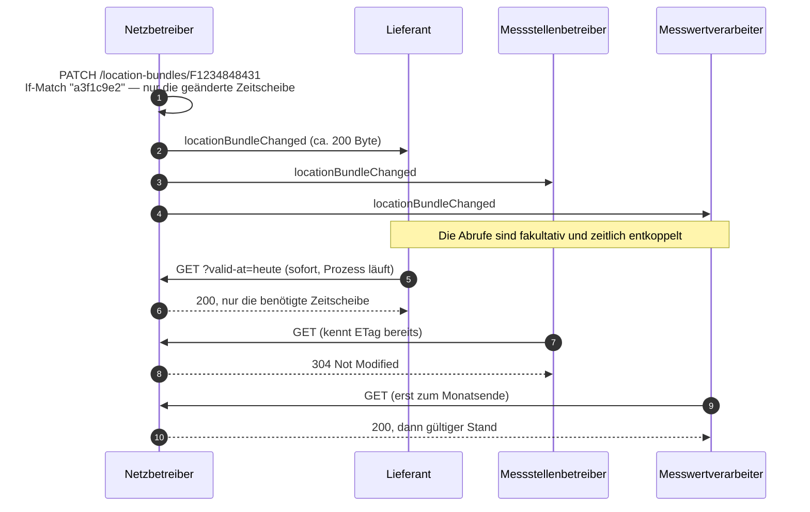

Angenommene Konstellation: ein Lokationsbündel mit drei Berechtigten — Lieferant,
Messstellenbetreiber, Messwertverarbeiter — und dem verantwortlichen Netzbetreiber.

<Note>
  Dies ist der Vorfall, bei dem der Referenzentwurf **keinen Rechenvorteil** hat. Wir halten
  es für wichtig, das offen zu benennen, statt einen Vorteil zu behaupten, den es nicht gibt.
</Note>

## Konsultierte Fassung — sechs Aufrufe

| Schritt | Richtung | Aufruf | Nutzlast |
|:---|:---|:---|:---|
| 1 | NB an LF | `POST /masterData/locationBundle/v1` | vollständiges Bündel, alle Zeitscheiben |
| 2 | NB an MSB | `POST /masterData/locationBundle/v1` | dasselbe vollständige Bündel |
| 3 | NB an MWV | `POST /masterData/locationBundle/v1` | dasselbe vollständige Bündel |
| 4 | LF an NB | `POST /masterData/locationBundle/result/v1` | Antwortcode, immer positiv |
| 5 | MSB an NB | `POST /masterData/locationBundle/result/v1` | Antwortcode, immer positiv |
| 6 | MWV an NB | `POST /masterData/locationBundle/result/v1` | Antwortcode, immer positiv |

Sechs Aufrufe, davon **drei mit vollständiger Nutzlast**. Jeder der drei Berechtigten hält
anschließend eine eigene Kopie des Bündels vor, die ab diesem Moment altern kann.

<Warning>
  Zur Antwort in den Schritten 4 bis 6: Das Schema `resultLocationBundle` beschreibt
  ausdrücklich, die Antwort sei „immer, dass der Empfänger des Lokationsbündels die Daten
  übernommen hat". Es gibt keine Ablehnung. Die Antwort trägt damit keine
  Entscheidungsinformation — sie ist eine Empfangsbestätigung, für die HTTP bereits einen
  Statuscode vorsieht.
</Warning>

## Referenzentwurf — ein interner Schreibvorgang, drei Ereignisse, Abrufe nach Bedarf

| Schritt | Richtung | Aufruf | Nutzlast |
|:---|:---|:---|:---|
| 1 | NB intern | `PATCH /location-bundles/F1234848431` auf dem eigenen Server | nur die geänderte Zeitscheibe |
| 2 | NB an LF | Ereignis `locationBundleChanged` | Typ, Zeitpunkt, URL, ETag — rund 200 Byte |
| 3 | NB an MSB | Ereignis `locationBundleChanged` | dito |
| 4 | NB an MWV | Ereignis `locationBundleChanged` | dito |
| 5–7 | Berechtigte an NB | `GET /location-bundles/F1234848431` — **wenn und wann sie es brauchen** | nur die benötigte Zeitscheibe |



### Der Änderungsaufruf

```http
PATCH /nb/2026-2/location-bundles/F1234848431
If-Match: "a3f1c9e2"
Content-Type: application/merge-patch+json

{
  "timeSlices": [
    {
      "validFrom": "2028-01-01",
      "validTo": null,
      "members": ["…"],
      "relations": ["…"]
    }
  ]
}
```

### Das Ereignis

```json
{
  "type": "locationBundleChanged",
  "eventId": "7f3e9a10-2b4c-4d5e-9f60-1a2b3c4d5e6f",
  "occurredAt": "2027-10-14T11:05:12Z",
  "resource": {
    "href": "/nb/2026-2/location-bundles/FXY98765432",
    "title": "Lokationsbündel FXY98765432"
  },
  "etag": "\"a3f1c9e2\""
}
```

Keine Fachdaten. Der Abonnent quittiert mit `204 No Content`.

## Bewertung — der Vorteil liegt nicht in der Anzahl

Zählt man die Schritte 5 bis 7 mit, kommt man ebenfalls auf **sechs**
Marktkommunikationsvorgänge. Der Unterschied liegt in drei anderen Punkten:

<Steps>
  <Step title="Die Abrufe sind fakultativ und zeitlich entkoppelt">
    Ein Messwertverarbeiter, der die Bündelstruktur erst zum Monatsende braucht, ruft sie zum
    Monatsende ab — und erhält dann den **dann gültigen** Stand, nicht den von vor drei
    Wochen. Im Push-Modell bekommt er den Stand von vor drei Wochen und muss selbst merken,
    dass er veraltet ist.
  </Step>
  <Step title="Die Ereignisse sind um Größenordnungen kleiner">
    Rund 200 Byte gegen ein vollständiges Bündel mit allen Zeitscheiben, dreimal. Und wer den
    `ETag` aus dem Ereignis bereits kennt, kann den Abruf ganz überspringen.
  </Step>
  <Step title="Die Berechtigten müssen nicht replizieren">
    Das ist der eigentliche Gewinn. Wer nicht repliziert, kann keinen Schiefstand haben — und
    erzeugt keinen der Klärfälle, die aus auseinandergelaufenen Kopien entstehen.
  </Step>
</Steps>

## Abonnement einrichten

```http
POST /nb/2026-2/subscriptions
Content-Type: application/vnd.edi-energy+json

{
  "callbackUrl": "https://api.example-lieferant.de/mako/events",
  "eventTypes": [
    "locationBundleChanged",
    "clearingCaseOpened",
    "clearingCaseResolved",
    "subscriptionRevoked"
  ],
  "filter": {
    "marketLocations": ["57685676748"],
    "networkLocations": ["E1234848431"]
  }
}
```

Antwort `201 Created` mit `Location` auf das Abonnement. Der Filter schränkt auf die Lokationen
ein, die den Abonnenten tatsächlich interessieren.

<Tip>
  Fällt die Berechtigung weg, wird das Abonnement serverseitig beendet und ein abschließendes
  Ereignis `subscriptionRevoked` zugestellt. Der Abonnent erfährt, dass und wann seine
  Berechtigung endete — statt stillschweigend keine Ereignisse mehr zu erhalten. Das folgt der
  Empfehlung des gemeinsamen Konsultationsbeitrags vom Oktober 2025.
</Tip>

## Die Rollenaufteilung

Das Ereignis trägt bewusst keine Fachdaten. Damit steigt die Wahrscheinlichkeit, dass die
Daten zum Zeitpunkt ihrer tatsächlichen Nutzung aktuell sind — und der
Benachrichtigungsdienst kann auf seine Kernaufgabe zugeschnitten werden, statt eine
1:N-Verteilung über eine Punkt-zu-Punkt-Architektur nachzubilden.
