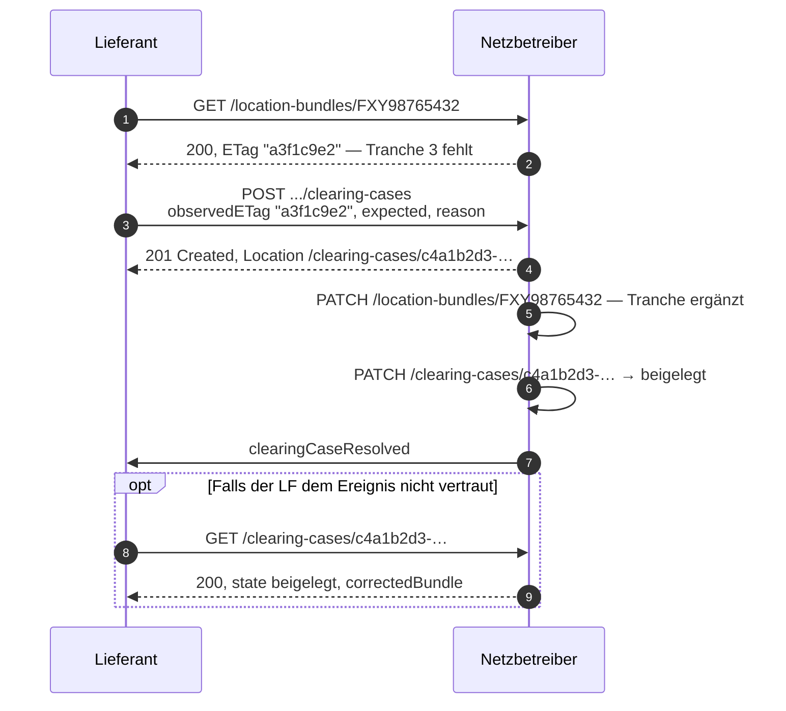
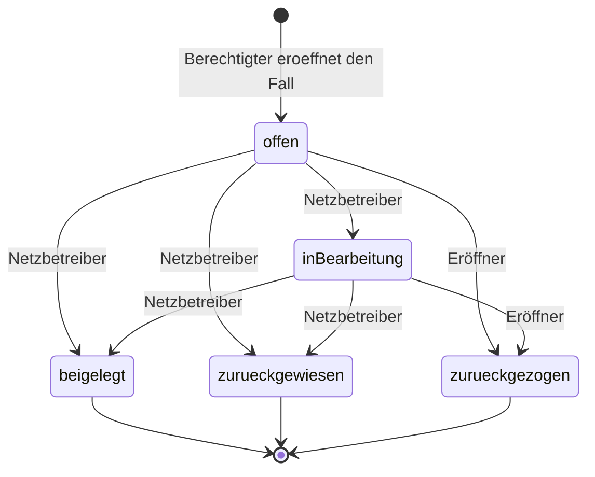

Der Lieferant beliefert seit dem 01.10.2027 eine dritte Tranche, die im Bündel nicht enthalten
ist.

<Columns cols={2}>
  <Card title="Konsultiert" icon="circle-question" horizontal>
    **5 Aufrufe** bei einem Berechtigten, **9** bei drei. Kein Rückbezug, kein Antwortkanal,
    kein Endzustand.
  </Card>
  <Card title="Referenzentwurf" icon="circle-check" horizontal>
    **2 Aufrufe** in der Pflicht. Der Fall hat eine URL, einen Zustand, eine Frist und einen
    Abschluss.
  </Card>
</Columns>

## Konsultierte Fassung

| Schritt | Richtung | Aufruf | Anmerkung |
|:---|:---|:---|:---|
| 1 | NB an LF | `POST /masterData/locationBundle/v1` | Bündel wird zugestellt |
| 2 | LF an NB | `POST /masterData/locationBundle/result/v1` | Pflichtantwort, positiv — obwohl der LF widerspricht |
| 3 | LF an NB | `POST /masterData/locationBundleClearing/v1` | Reklamation |
| 4 | NB an LF | `POST /masterData/locationBundle/v1` | Korrektur als **Vollübermittlung** des gesamten Bündels |
| 5 | LF an NB | `POST /masterData/locationBundle/result/v1` | Pflichtantwort auf die Korrektur |

Fünf Aufrufe, davon zwei Vollübermittlungen. Bei drei Berechtigten kommen für die Korrektur
zwei weitere Vollübermittlungen plus zwei Antworten hinzu: **neun Aufrufe**.

### Vier strukturelle Probleme

<AccordionGroup>
  <Accordion title="Der Clearing-Aufruf trägt keine Vorgangsreferenz" icon="link-slash">
    Der Pfad `/locationBundleClearing/v1` kennt keinen `referenceId`-Header. Das Clearing
    lässt sich damit keiner konkreten vorangegangenen Übermittlung zuordnen, sondern nur der
    Lokation.
  </Accordion>
  <Accordion title="Es gibt keinen Antwortkanal zum Clearing" icon="comment-slash">
    `resultLocationBundle` ist ausdrücklich die „Antwort auf die Übermittlung von
    Lokationsbündeln", nicht auf ein Clearing. Der Lieferant erfährt nicht, ob und wie sein
    Clearing bearbeitet wird — er merkt es allenfalls daran, dass irgendwann eine korrigierte
    Übermittlung eintrifft.
  </Accordion>
  <Accordion title="Es gibt keinen definierten Endzustand" icon="circle-half-stroke">
    Das Clearing hat keinen Zustand, keine Frist und keinen Abschluss. Ob ein Fall offen, in
    Bearbeitung oder erledigt ist, ist außerhalb der beteiligten Sachbearbeitung nicht
    feststellbar.
  </Accordion>
  <Accordion title="Schritt 2 erzwingt eine unzutreffende Aussage" icon="triangle-exclamation">
    Der Lieferant muss den Empfang mit einem Code bestätigen, der ausdrücklich Übernahme
    bedeutet, obwohl er widerspricht.
  </Accordion>
</AccordionGroup>

## Referenzentwurf

| Schritt | Richtung | Aufruf | Antwort |
|:---|:---|:---|:---|
| 1 | LF an NB | `POST /location-bundles/F.../clearing-cases` mit `observedETag`, `expected`, `reason` | `201 Created` mit `Location` auf den Fall |
| 2 | NB intern | `PATCH /location-bundles/F...` — Korrektur | — |
| 3 | NB intern | `PATCH /clearing-cases/{id}` zu `state: beigelegt`, `resolution.correctedBundle` | — |
| 4 | NB an LF, MSB, MWV | Ereignis `clearingCaseResolved` bzw. `locationBundleChanged` | — |
| 5 | LF an NB | `GET /clearing-cases/{id}` — optional, sofern der LF nicht dem Ereignis vertraut | `200` mit Zustand und Verweis auf den korrigierten Stand |



## Der Zustandsautomat



| Übergang | Ausgelöst durch | Voraussetzung |
|---|---|---|
| → `inBearbeitung` | Netzbetreiber | — |
| → `beigelegt` | Netzbetreiber | Bündel korrigiert, `resolution.correctedBundle` verweist auf den neuen Stand |
| → `zurueckgewiesen` | Netzbetreiber | Antwortcode aus dem Entscheidungsbaumdiagramm und Begründung |
| → `zurueckgezogen` | der Eröffner | — |

<Warning>
  Ein unzulässiger Übergang wird mit `422` und einem Problem-Details-Dokument abgelehnt, das
  den aktuellen und die zulässigen Folgezustände nennt. Der Zustandsübergang ist im Schema
  festgelegt, nicht der Sachbearbeitung überlassen.
</Warning>

## Fall eröffnen

```http
POST /nb/2026-2/location-bundles/FXY98765432/clearing-cases
Content-Type: application/vnd.edi-energy+json
Idempotency-Key: 3d1f7c22-8a90-4b11-9e33-6c5d0a7b2e14

{
  "timeSlice": "2027-10-01",
  "observedETag": "\"a3f1c9e2\"",
  "expected": {
    "validFrom": "2027-10-01",
    "validTo": null,
    "members": ["…", { "type": "Tranche", "trancheId": "41234567803" }],
    "relations": ["…", { "kind": "MarktlokationZuTranche", "from": "41234567890", "to": "41234567803" }]
  },
  "reason": "Tranche 41234567803 ist seit 01.10.2027 beliefert, im Bündel jedoch nicht enthalten."
}
```

<Note>
  `observedETag` hält fest, auf welchen Stand sich der Fall bezieht — auch wenn der
  Netzbetreiber zwischenzeitlich ändert. Das ist der Beweis dafür, was der Eröffner gesehen
  hat, und beantwortet den Revisionssicherheitseinwand.

  `expected` ist keine Prosa-Beschreibung, sondern eine vollständige Zeitscheibe im selben
  Format wie die tatsächliche. Der Netzbetreiber kann die Abweichung maschinell ermitteln,
  statt sie aus einem Freitextfeld zu lesen.

  Der optionale `Idempotency-Key` verhindert doppelte Fälle bei Wiederholungsaufrufen. Besteht
  zu demselben Sachverhalt bereits ein offener Fall, antwortet der Server mit `409` und
  verweist über `instance` auf dessen URL.
</Note>

## Fall abschließen

```http
PATCH /nb/2026-2/clearing-cases/c4a1b2d3-0e5f-4a6b-8c7d-9e0f1a2b3c4d
If-Match: "f0e1d2c3"
Content-Type: application/merge-patch+json

{
  "state": "beigelegt",
  "resolution": {
    "decisionTree": "E_0594",
    "responseCode": "A10",
    "reason": "Tranche war beim Netzbetreiber noch nicht eingepflegt, wurde ergänzt.",
    "correctedBundle": {
      "href": "/nb/2026-2/location-bundles/FXY98765432/time-slices/2027-10-01"
    },
    "resolvedAt": "2027-10-14T11:05:00Z"
  }
}
```

<Tip>
  **Die Antwortcodes der Entscheidungsbaumdiagramme bleiben erhalten.** `decisionTree`
  (`^E_\d{4}$`) und `responseCode` (`^A[A-Z\d]{2}$`) sind unverändert aus der bestehenden
  Regulierung übernommen. Sie werden lediglich an einer Ressource mit Zustand geführt statt in
  einem Aufruf ohne Rückbezug.
</Tip>

`correctedBundle` verweist auf den korrigierten Stand. Der Eröffner kann ihn unmittelbar
abrufen und prüfen — er muss nicht auf eine gesonderte Übermittlung warten.

## Der Fall als Dokument

Vollständig in
[`examples/06-clearing-fall.json`](https://github.com/engrate/mako-api-referenzentwurf/blob/main/examples/06-clearing-fall.json):

```json
{
  "data": {
    "type": "ClearingFall",
    "clearingCaseId": "c4a1b2d3-0e5f-4a6b-8c7d-9e0f1a2b3c4d",
    "href": "/nb/2026-2/clearing-cases/c4a1b2d3-0e5f-4a6b-8c7d-9e0f1a2b3c4d",
    "state": "beigelegt",
    "openedBy": { "marketPartnerId": "9900555444333", "role": "LF" },
    "openedAt": "2027-10-12T09:30:00Z",
    "dueAt": "2027-10-26T22:00:00Z",
    "subject": {
      "locationBundle": { "href": "/nb/2026-2/location-bundles/FXY98765432" },
      "timeSlice": { "href": "/nb/2026-2/location-bundles/FXY98765432/time-slices/2027-10-01" }
    },
    "expected": { "…": "…" },
    "reason": "Tranche 41234567803 ist seit 01.10.2027 beliefert, im Bündel jedoch nicht enthalten.",
    "resolution": {
      "decisionTree": "E_0594",
      "responseCode": "A10",
      "correctedBundle": { "href": "/nb/2026-2/location-bundles/FXY98765432/time-slices/2027-10-01" },
      "resolvedAt": "2027-10-14T11:05:00Z"
    }
  },
  "links": {
    "self": { "href": "/nb/2026-2/clearing-cases/c4a1b2d3-0e5f-4a6b-8c7d-9e0f1a2b3c4d" },
    "bundle": { "href": "/nb/2026-2/location-bundles/FXY98765432" }
  }
}
```

`dueAt` ist die Frist, bis zu der der Verantwortliche zu reagieren hat. Beide Seiten können
jederzeit abrufen, wie der Stand ist — mit `GET /clearing-cases/{id}` oder über die Liste
`GET /location-bundles/{id}/clearing-cases?state=offen`.

## Bewertung

Zwei Marktkommunikationsaufrufe in der Pflicht, dazu Ereignisse und fakultative Abrufe. Der
entscheidende Unterschied ist aber nicht die Zahl: Der Fall wird **nachvollziehbar und
abschließbar**. Was heute nur in der Sachbearbeitung beider Häuser existiert, ist hier
Protokollzustand.

<CardGroup cols={2}>
  <Card title="Fehlerbehandlung" icon="triangle-exclamation" href="/architektur/fehlerbehandlung">
    Wie eine Ablehnung mit JSON-Pointer aussieht — und warum sie in der konsultierten Fassung
    gar nicht möglich ist.
  </Card>
  <Card title="Vorfall A — Stand prüfen" icon="magnifying-glass" href="/ablaeufe/stand-pruefen">
    Der Vorgang, der den überwiegenden Teil dieser Fälle vorab verhindert.
  </Card>
</CardGroup>
