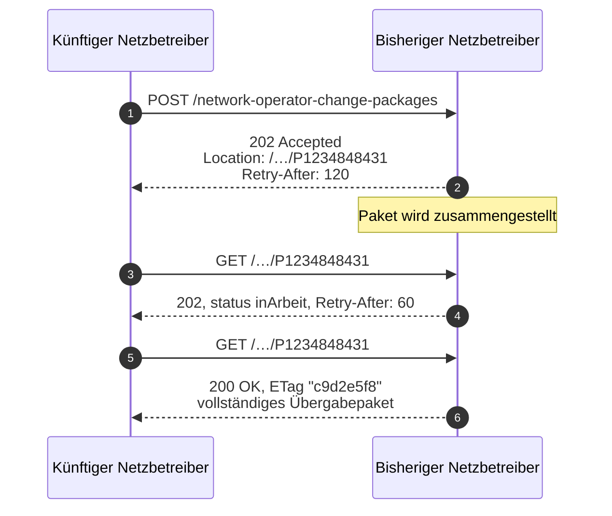

Die Zusammenstellung eines Übergabepakets kann umfangreich sein und innerhalb eines
technischen Timeouts nicht abschließbar. Statt eine Rückrufkonstruktion mit selbst geführtem
Zustand einzuführen, nutzt der Entwurf das in HTTP dafür vorgesehene Verfahren.

## Der Ablauf

<Steps>
  <Step title="Anfordern — 202 Accepted">
    ```http
    POST /nb/2026-2/network-operator-change-packages
    Content-Type: application/vnd.edi-energy+json

    {
      "locationBundleId": "F1234848431",
      "effectiveFrom": "2028-01-01",
      "successorNetworkOperator": { "marketPartnerId": "9900111222333", "role": "NB" }
    }
    ```

    ```http
    HTTP/1.1 202 Accepted
    Location: /nb/2026-2/network-operator-change-packages/P1234848431
    Retry-After: 120
    ```

    Der Server nennt die URL der **künftigen** Ergebnisressource und den frühesten sinnvollen
    Abrufzeitpunkt.
  </Step>
  <Step title="Noch nicht fertig — erneut 202">
    ```http
    GET /nb/2026-2/network-operator-change-packages/P1234848431
    ```

    ```http
    HTTP/1.1 202 Accepted
    Retry-After: 60
    Content-Type: application/vnd.edi-energy+json

    {
      "status": "inArbeit",
      "expectedAvailableAt": "2027-11-02T15:10:00Z"
    }
    ```

    Dieselbe URL, aktualisiertes `Retry-After`, und ein Körper, der sagt, woran man ist.
  </Step>
  <Step title="Fertig — 200 mit der Ressource">
    ```http
    GET /nb/2026-2/network-operator-change-packages/P1234848431
    ```

    ```http
    HTTP/1.1 200 OK
    ETag: "c9d2e5f8"
    Content-Type: application/vnd.edi-energy+json

    { "data": { "…": "…" }, "links": { "…": "…" } }
    ```

    Derselbe `GET` gibt jetzt die Ressource zurück. Der Aufrufer muss dafür **keinen
    Vorgangszustand vorhalten** — die URL ist der Zustand.
  </Step>
</Steps>



<Tip>
  Derselbe Mechanismus ließe sich für jede Operation verwenden, die lange dauern kann — etwa
  die Massendatenerstbefüllung, die dieser Entwurf bewusst offen lässt. Er erfordert keine
  Sonderkonstruktion, sondern nur `202`, `Location` und `Retry-After`.
</Tip>

## Das Paket verweist, statt zu kopieren

```json
{
  "data": {
    "type": "NetzbetreiberwechselPaket",
    "packageId": "P1234848431",
    "effectiveFrom": "2028-01-01",
    "locationBundle": { "href": "/nb/2026-2/location-bundles/F1234848431" },
    "assignments": [
      {
        "objectType": "Messlokation",
        "objectId": "DE00014545768S0000000000000003054",
        "href": "/nb/2026-2/metering-locations/DE00014545768S0000000000000003054",
        "meteringPointOperator": { "marketPartnerId": "9900123456789", "role": "MSB" }
      },
      {
        "objectType": "Marktlokation",
        "objectId": "57685676748",
        "href": "/nb/2026-2/market-locations/57685676748",
        "supplier": { "marketPartnerId": "9900555444333", "role": "LF" },
        "transmissionSystemOperator": { "marketPartnerId": "9900777888999", "role": "UENB" }
      }
    ]
  },
  "links": {
    "self": { "href": "/nb/2026-2/network-operator-change-packages/P1234848431" },
    "locationBundle": { "href": "/nb/2026-2/location-bundles/F1234848431" }
  }
}
```

### Zwei Unterschiede zur konsultierten Fassung

<AccordionGroup>
  <Accordion title="Verweis statt Einbettung" icon="link" defaultOpen>
    In der konsultierten Fassung wird das vollständige Lokationsbündel in das Wechselpaket
    **eingebettet**. Damit existieren zwei Kopien desselben Sachverhalts, die auseinanderlaufen
    können.

    Schlimmer noch: Das Paket mischt dadurch zwei Zeitmodelle, weil das eingebettete Bündel
    Zeitscheiben trägt, die Marktpartnerzuordnung des Pakets aber ausdrücklich nicht.

    Hier verweist `locationBundle` auf das Bündel. Es gibt eine Fassung, und sie ist aktuell.
  </Accordion>
  <Accordion title="Eine Liste statt fünf paralleler Arrays" icon="list">
    Die Marktpartnerzuordnung ist eine einheitliche Liste von `OperatorAssignment` über alle
    Objekttypen — statt fünf parallelen, gleichartigen Arrays je Objekttyp.

    `objectType` nimmt `Netzlokation`, `Messlokation`, `Marktlokation`, `Tranche` oder
    `SteuerbareRessource`. Ein Client, der die Zuordnungen verarbeiten will, schreibt eine
    Schleife statt fünf.
  </Accordion>
</AccordionGroup>

## Zeitmodell des Pakets

`effectiveFrom` ist der Wechselzeitpunkt als Kalendertag. Die `assignments` beschreiben die
Marktpartnerzuordnung **zu diesem Zeitpunkt** — nicht über die Zeit. Wer die zeitliche
Entwicklung braucht, folgt `links.locationBundle` und liest dort die Zeitscheiben.

Diese Trennung ist beabsichtigt: Das Paket ist eine Momentaufnahme für einen Stichtag, das
Bündel ist der Verlauf.
