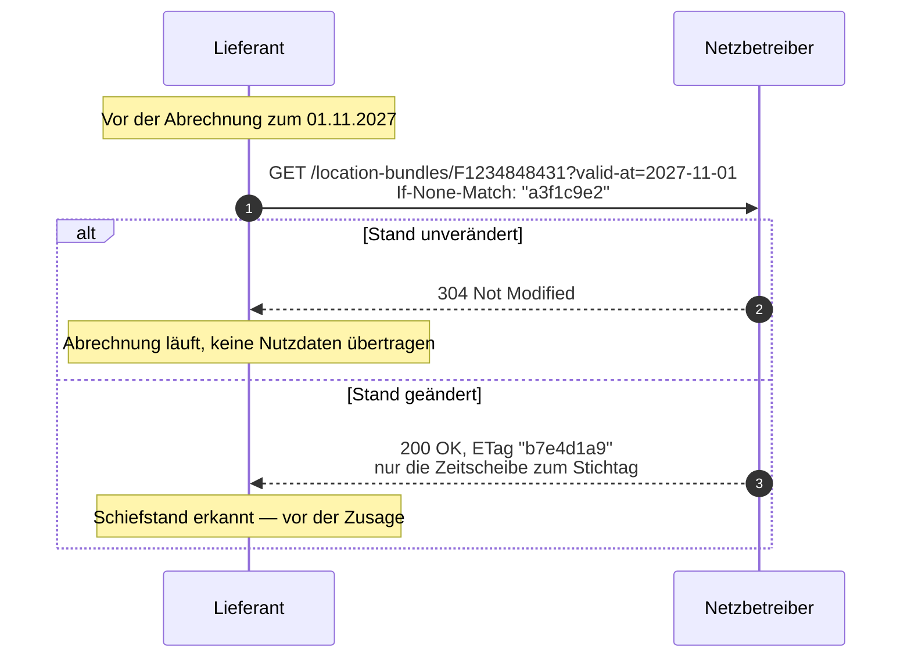

Dies ist der häufigste und zugleich folgenreichste Vorgang. Ein Lieferant, der eine Zusage
machen, eine Abrechnung erstellen oder eine Bestellung auslösen will, braucht Gewissheit über
die Bündelstruktur.

<Columns cols={2}>
  <Card title="Konsultiert" icon="ban" horizontal>
    **Nicht möglich.** Es existiert kein Leseendpunkt.
  </Card>
  <Card title="Referenzentwurf" icon="bolt" horizontal>
    **Ein Aufruf**, im Regelfall ohne Nutzdaten, wenige Millisekunden.
  </Card>
</Columns>

## Konsultierte Fassung

| Schritt | Aufruf | Anmerkung |
|:---|:---|:---|
| — | — | **Nicht möglich.** Es existiert kein Leseendpunkt. |

Der Lieferant hat drei Handlungsmöglichkeiten:

<AccordionGroup>
  <Accordion title="Er verlässt sich auf den zuletzt zugesandten Stand" icon="hourglass">
    Ohne prüfen zu können, ob dieser noch gilt. Wenn er nicht mehr gilt, löst er Transaktionen
    auf falscher Grundlage aus — und erfährt es erst, wenn der Fehler an anderer Stelle
    auffällt.
  </Accordion>
  <Accordion title="Er eröffnet ein Clearing, um eine Rückmeldung zu erzwingen" icon="gavel">
    Das erzeugt genau den Klärfall, den man vermeiden wollte — und belastet beide Seiten mit
    manueller Bearbeitung für eine Frage, die eine Leseoperation beantwortet hätte.
  </Accordion>
  <Accordion title="Er greift zum Telefon" icon="phone">
    Der in der Praxis häufigste Weg. Nicht protokolliert, nicht skalierbar, nicht
    revisionssicher.
  </Accordion>
</AccordionGroup>

## Referenzentwurf

| Schritt | Aufruf | Antwort |
|:---|:---|:---|
| 1 | `GET /location-bundles/F1234848431?valid-at=2027-11-01`, `If-None-Match: "a3f1c9e2"` | `304 Not Modified` — kein Nutzdatentransfer |

<CodeGroup>
```http Anfrage
GET /nb/2026-2/location-bundles/F1234848431?valid-at=2027-11-01
If-None-Match: "a3f1c9e2"
Authorization: Bearer …
```

```http Stand gilt noch
HTTP/1.1 304 Not Modified
ETag: "a3f1c9e2"
Cache-Control: private, max-age=3600
```

```http Stand hat sich geändert
HTTP/1.1 200 OK
ETag: "b7e4d1a9"
Last-Modified: Tue, 02 Nov 2027 14:45:00 GMT
Content-Type: application/vnd.edi-energy+json

{
  "data": {
    "type": "Lokationsbuendel",
    "locationBundleId": "F1234848431",
    "timeSlices": [
      { "validFrom": "2027-10-01", "validTo": null, "members": ["…"], "relations": ["…"] }
    ]
  },
  "links": { "self": { "href": "/nb/2026-2/location-bundles/F1234848431" } }
}
```
</CodeGroup>

Bei geändertem Stand liefert derselbe Aufruf `200` mit **genau der Zeitscheibe**, die zum
angefragten Stichtag gilt — nicht dem gesamten Bündel.



## Bewertung

<Warning>
  Dies ist der wesentliche Unterschied. Ein Lieferant, der zu Prozessbeginn den aktuellen
  Stand abruft, kann auf einen Schiefstand reagieren, **bevor** er Zusagen macht oder
  Transaktionen auslöst, die anschließend nur manuell rückabzuwickeln sind.

  In der konsultierten Fassung ist dieser Vorgang architektonisch ausgeschlossen.
</Warning>

Drei Eigenschaften machen den Aufruf billig genug, um ihn zur Routine zu machen:

<Columns cols={3}>
  <Card title="Bedingt" icon="code-compare">
    `If-None-Match` führt bei unverändertem Stand zu `304` ohne Nutzdaten. Der Regelfall bei
    Stammdaten.
  </Card>
  <Card title="Zugeschnitten" icon="scissors">
    `valid-at` liefert nur die Zeitscheibe zum Stichtag, nicht die Historie und nicht die
    Zukunft.
  </Card>
  <Card title="Zwischenspeicherbar" icon="database">
    `Cache-Control: private, max-age=3600` erlaubt dem Client, innerhalb seiner eigenen
    Infrastruktur gar nicht erst zu fragen.
  </Card>
</Columns>

## Weiter

<CardGroup cols={2}>
  <Card title="Nebenläufigkeit" icon="code-compare" href="/architektur/nebenlaeufigkeit">
    Wie `ETag`, `If-None-Match` und `Cache-Control` zusammenwirken.
  </Card>
  <Card title="Vorfall C — Clearing" icon="gavel" href="/ablaeufe/clearing">
    Was passiert, wenn der abgerufene Stand tatsächlich von der eigenen Sicht abweicht.
  </Card>
</CardGroup>
