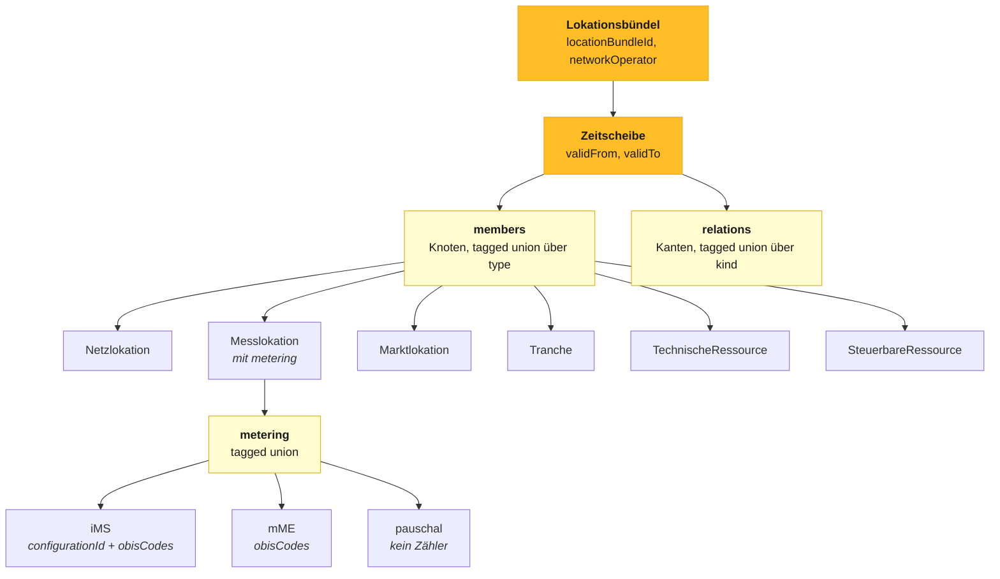
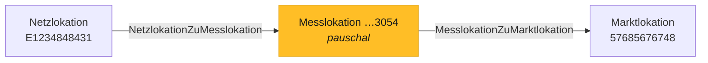
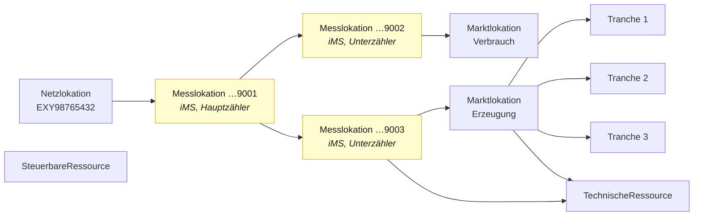

Ein Lokationsbündel ist ein **Graph**: Knoten sind Lokationen und Ressourcen, Kanten sind
ihre Zuordnungen. Der Graph gilt jeweils für eine Zeitscheibe.



## Knoten

Sechs Knotentypen, unterschieden über das Feld `type`. Jeder Typ legt abschließend fest,
welche Felder zulässig und welche erforderlich sind — alle tragen
`additionalProperties: false`.

| `type` | Pflichtfelder | Optional |
|---|---|---|
| `Netzlokation` | `neloId` | `href` |
| `Messlokation` | `meloId`, `metering` | `href`, `meteringPointOperator` |
| `Marktlokation` | `maloId` | `href`, `supplier`, `transmissionSystemOperator` |
| `Tranche` | `trancheId` | `href`, `supplier` |
| `TechnischeRessource` | `trId` | `href` |
| `SteuerbareRessource` | `srId` | `href` |

<Tip>
  **Die Tranche ist ein eigener Knotentyp.** In der konsultierten Fassung ist sie kein
  eigenes Objekt, sondern eine ID-Liste unter der Marktlokation, die den Datentyp der
  Marktlokations-ID mitbenutzt. Ob eine gegebene elfstellige Ziffernfolge eine Marktlokation
  oder eine Tranche bezeichnet, ergibt sich dort nur aus der Position im Dokument. Als
  eigener Typ ist es eindeutig.
</Tip>

## Kanten

Sechs Kantentypen, unterschieden über das Feld `kind`. Der Katalog ist **abschließend**:
Zuordnungen, die es fachlich nicht gibt, sind nicht darstellbar.

| `kind` | `from` | `to` |
|---|---|---|
| `NetzlokationZuMesslokation` | NeLo-ID | MeLo-ID |
| `MesslokationZuMesslokation` | MeLo-ID | MeLo-ID |
| `MesslokationZuMarktlokation` | MeLo-ID | MaLo-ID |
| `MesslokationZuTechnischerRessource` | MeLo-ID | TR-ID |
| `MarktlokationZuTechnischerRessource` | MaLo-ID | TR-ID |
| `MarktlokationZuTranche` | MaLo-ID | MaLo-ID (Tranche) |

Die Kante `MesslokationZuMesslokation` bildet die **Messlokationskaskade** ab — Hauptzähler
mit Unterzählern, wie sie für Speicher und Ladepunkte hinter einem Netzanschluss erforderlich
ist.

<Warning>
  Eine Kante von einer Netzlokation direkt auf eine Marktlokation existiert nicht im Katalog
  und wird abgelehnt. Das Negativbeispiel
  [`05-UNGUELTIG-unzulaessige-kante.json`](/referenz/beispiele)
  belegt das.
</Warning>

## Ein vollständiges Bündel

Das einfachste gültige Bündel: eine pauschale Marktlokation ohne Zähler — Straßenbeleuchtung.

```json Nutzdaten
{
  "data": {
    "type": "Lokationsbuendel",
    "locationBundleId": "F1234848431",
    "href": "/nb/2026-2/location-bundles/F1234848431",
    "networkOperator": {
      "marketPartnerId": "9900987654321",
      "role": "NB",
      "href": "/nb/2026-2/market-partners/9900987654321"
    },
    "changedAt": "2027-09-14T08:12:03Z",
    "timeSlices": [
      {
        "href": "/nb/2026-2/location-bundles/F1234848431/time-slices/2027-10-01",
        "validFrom": "2027-10-01",
        "validTo": null,
        "members": [
          {
            "type": "Netzlokation",
            "neloId": "E1234848431",
            "href": "/nb/2026-2/network-locations/E1234848431"
          },
          {
            "type": "Messlokation",
            "meloId": "DE00014545768S0000000000000003054",
            "meteringPointOperator": { "marketPartnerId": "9900123456789", "role": "MSB" },
            "metering": {
              "type": "pauschal",
              "description": "Straßenbeleuchtung, pauschal abgerechnet, keine Messeinrichtung"
            }
          },
          {
            "type": "Marktlokation",
            "maloId": "57685676748",
            "supplier": { "marketPartnerId": "9900555444333", "role": "LF" }
          }
        ],
        "relations": [
          {
            "kind": "NetzlokationZuMesslokation",
            "from": "E1234848431",
            "to": "DE00014545768S0000000000000003054"
          },
          {
            "kind": "MesslokationZuMarktlokation",
            "from": "DE00014545768S0000000000000003054",
            "to": "57685676748"
          }
        ]
      }
    ]
  },
  "links": {
    "self": { "href": "/nb/2026-2/location-bundles/F1234848431" },
    "timeSlices": { "href": "/nb/2026-2/location-bundles/F1234848431/time-slices" },
    "clearingCases": { "href": "/nb/2026-2/location-bundles/F1234848431/clearing-cases" }
  }
}
```

Derselbe Sachverhalt als Graph:



Vollständig nachvollziehbar in
[`examples/01-pauschale-marktlokation.json`](https://github.com/engrate/mako-api-referenzentwurf/blob/main/examples/01-pauschale-marktlokation.json).

## Ein anspruchsvoller Fall

Speicher und Ladepunkt hinter einem Netzanschluss mit Unterzählung — der Fall, für den die
Festlegung MiSpeL (Az. 618-25-02) die Rechenformeln zur anteiligen Zuordnung
viertelstündlicher Mengen definiert. Unter der bisherigen Codeliste der
Lokationsbündelstrukturen war er typischerweise nur als „nicht standardisiert" abbildbar.



Das Beispiel
[`examples/03-speicher-ladepunkt.json`](https://github.com/engrate/mako-api-referenzentwurf/blob/main/examples/03-speicher-ladepunkt.json)
enthält diesen Fall vollständig, mit Kaskade, Tranchen und steuerbarer Ressource.

## Identifikatoren

Unverändert aus der konsultierten Fassung übernommen, einschließlich der Prüfmuster:

| Schema | Muster | Beispiel |
|---|---|---|
| `LocationBundleId` | `^F[A-Z\d]{9}\d$` | `F1234848431` |
| `NeloId` | `^E[A-Z\d]{9}\d$` | `E1234848431` |
| `MaloId` | `^\d{11}$` | `57685676748` |
| `MeloId` | `^DE\d{11}[A-Z\d]{20}$` | `DE00014545768S0000000000000003054` |
| `TrId` | `^D[A-Z\d]{9}\d$` | `D1234848431` |
| `SrId` | `^C[A-Z\d]{9}\d$` | `C1234848431` |
| `MarketPartnerId` | `^\d{13}$` | `9900987654321` |
| `NetworkOperatorChangePackageId` | `^P[A-Z\d]{9}\d$` | `P1234848431` |

<Note>
  **Zur Lokationsbündel-ID.** Beitrag #175 im Repository `EDI-Energy/api-electricity`
  (20.08.2026) macht geltend, dass nach der Bildungsvorschrift an der ersten Stelle `G` statt
  `F` stehen muss. Wir teilen diese Auffassung. Der Entwurf verwendet weiterhin `F`, um gegen
  den konsultierten Stand vergleichbar zu bleiben; die Stelle ist im Schema entsprechend
  kommentiert. Wird der Beitrag angenommen, sind Muster und Beispiele auf `G` zu ändern.
</Note>

## Marktpartner

Marktrollen werden über `MarketPartnerRef` referenziert — Marktpartner-ID, Rolle und
optional ein `href`:

```json
{ "marketPartnerId": "9900555444333", "role": "LF" }
```

Zulässige Rollen: `NB` (Netzbetreiber), `LF` (Lieferant), `MSB` (Messstellenbetreiber),
`MWV` (Messwertverarbeiter), `UENB` (Übertragungsnetzbetreiber).

Der Netzbetreiber bleibt der Verantwortliche für das Lokationsbündel; die übrigen Rollen
sind Berechtigte. Daran ändert der Entwurf nichts — siehe
[Was unverändert bleibt](/referenz/unveraendert).
