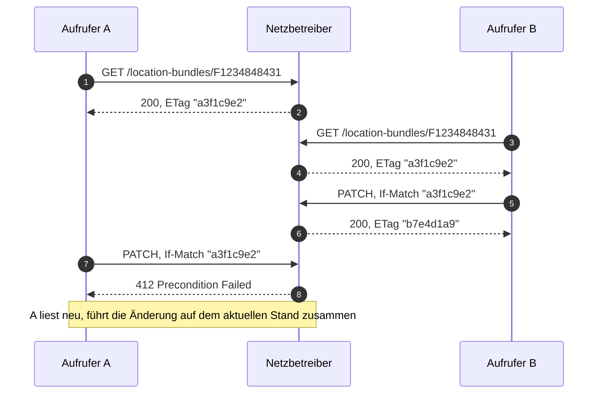

Jede Ressource trägt einen `ETag`. Daraus ergeben sich zwei Dinge, die die konsultierte
Fassung nicht regelt: Schutz vor verlorenen Änderungen und Zwischenspeicherbarkeit.

## Lesen: bedingte Anfrage

Ein Berechtigter, der einen Stand bereits kennt, fragt mit `If-None-Match`:

<CodeGroup>
```http Anfrage
GET /nb/2026-2/location-bundles/F1234848431?valid-at=2027-11-01
If-None-Match: "a3f1c9e2"
```

```http Unverändert
HTTP/1.1 304 Not Modified
ETag: "a3f1c9e2"
Cache-Control: private, max-age=3600
```

```http Geändert
HTTP/1.1 200 OK
ETag: "b7e4d1a9"
Last-Modified: Tue, 02 Nov 2027 14:45:00 GMT
Cache-Control: private, max-age=3600
Content-Type: application/vnd.edi-energy+json

{ "data": { "…": "…" } }
```
</CodeGroup>

Ein Aufruf, im Regelfall **keine Nutzdaten**, wenige Millisekunden. Das ist die Antwort auf
den Lasteinwand: Lokationsbündel sind Stammdaten, die sich selten ändern, und HTTP ist bei
korrekter Nutzung von Caching auf genau dieses Lastprofil ausgelegt.

<Note>
  Siehe [Antizipierte Einwände](/gegenueberstellung/einwaende)
  zur Lastfrage im Einzelnen.
</Note>

## Schreiben: optimistische Nebenläufigkeit

`If-Match` ist bei **jedem** schreibenden Zugriff Pflicht. Fehlt der Header, wird der Aufruf
mit `428 Precondition Required` abgelehnt.



Ohne diesen Schutz überschreibt A die Änderung von B unbemerkt. Die konsultierte Fassung
regelt Nebenläufigkeit nicht.

| Statuscode | Anlass |
|---|---|
| `412 Precondition Failed` | `If-Match` gesetzt, entspricht aber nicht dem aktuellen Stand |
| `428 Precondition Required` | Schreibender Zugriff ohne `If-Match` |

## Idempotenz nach HTTP-Semantik

`PUT` und `DELETE` sind nach HTTP-Semantik idempotent: Ein wiederholter identischer Aufruf
hat dieselbe Wirkung wie ein einzelner. Ein gesonderter Idempotenzschlüssel im Header — wie
ihn die konsultierte Fassung mit `initialTransactionId` einführt — ist damit nicht
erforderlich.

<Columns cols={2}>
  <Card title="Idempotent von Natur aus" icon="rotate-right" horizontal>
    `PUT /location-bundles/{id}`
    `PUT .../time-slices/{validFrom}`
    `DELETE .../time-slices/{validFrom}`
    `DELETE /subscriptions/{id}`
  </Card>
  <Card title="Nicht idempotent" icon="triangle-exclamation" horizontal>
    `POST /location-bundles/{id}/clearing-cases` erzeugt bei jedem Aufruf einen neuen Fall.
    Hier ist ein optionaler `Idempotency-Key` vorgesehen: Ein Wiederholungsaufruf mit
    demselben Schlüssel gibt den bereits erzeugten Fall zurück.
  </Card>
</Columns>

Zusätzlich schützt der Server fachlich: Besteht zu demselben Sachverhalt bereits ein offener
Clearing-Fall, antwortet er mit `409 Conflict` und verweist über `instance` auf dessen URL.

## Zwischenspeicherung

| Header | Beispielwert | Zweck |
|---|---|---|
| `ETag` | `"a3f1c9e2"` | Version für bedingte Anfragen |
| `Last-Modified` | `Tue, 02 Nov 2027 14:45:00 GMT` | Zeitpunkt der letzten Änderung |
| `Cache-Control` | `private, max-age=3600` | Zwischenspeicherbarkeit |

`private` ist hier die richtige Wahl: Die Antwort hängt von der Berechtigung des Aufrufers
ab, darf also nicht in einem gemeinsamen Zwischenspeicher liegen. Innerhalb der
Client-Infrastruktur eines Marktpartners ist sie beliebig zwischenspeicherbar.

<Tip>
  Das ist der Punkt, an dem der Pull-Ansatz günstiger wird als der Push-Ansatz: Im
  Push-Modell erzeugt jede Änderung sofort eine Vollübermittlung an jeden Berechtigten,
  unabhängig davon, ob dieser die Daten braucht. Im Pull-Modell entsteht Last nur bei
  tatsächlichem Bedarf — und der überwiegende Teil dieser Last wird mit `304` ohne Nutzdaten
  beantwortet.
</Tip>

## Das Ereignis trägt den ETag mit

Ein Änderungsereignis nennt den `ETag` des neuen Stands. Ein Abonnent, der diesen Stand
bereits kennt, kann den Abruf ganz überspringen:

```json examples/07-aenderungsereignis.json
{
  "type": "locationBundleChanged",
  "eventId": "7f3e9a10-2b4c-4d5e-9f60-1a2b3c4d5e6f",
  "occurredAt": "2027-10-14T11:05:12Z",
  "resource": {
    "href": "/nb/2026-2/location-bundles/FXY98765432",
    "title": "Lokationsbündel FXY98765432"
  },
  "etag": "\"a3f1c9e2\""
}
```

Rund 200 Byte, keine Fachdaten. Siehe
[Änderung verteilen](/ablaeufe/aenderung-verteilen).

## Der ETag als Beweismittel

Ein Clearing-Fall hält im Feld `observedETag` fest, auf welchen Stand er sich bezieht — auch
wenn der Netzbetreiber zwischenzeitlich ändert:

```json
{
  "timeSlice": "2027-10-01",
  "observedETag": "\"a3f1c9e2\"",
  "expected": { "…": "…" },
  "reason": "Tranche 41234567803 ist seit 01.10.2027 beliefert, im Bündel jedoch nicht enthalten."
}
```

Damit beantwortet der Entwurf den Einwand, der Versand sei revisionssicher und der Abruf
nicht: Für den Nachweis, welchen Stand ein Berechtigter zu einem bestimmten Zeitpunkt gesehen
hat, gibt es ein Feld. Siehe
[Antizipierte Einwände](/gegenueberstellung/einwaende#der-versand-ist-revisionssicher-der-abruf-nicht).
