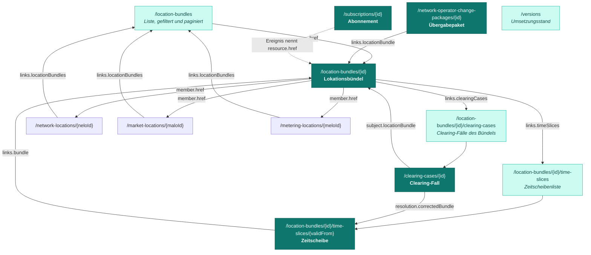

Vier `POST`-Endpunkte werden zu 14 Pfaden mit 22 Operationen. Der Zugewinn liegt nicht in
der Zahl, sondern darin, dass jeder Sachverhalt, über den in der Marktkommunikation geredet
wird, eine **eigene Adresse** bekommt.

## Identität über die URL

In der konsultierten Fassung steckt die Identität im Dokumentenkörper: Der Empfänger muss
den Fachschlüssel aus dem Body lesen und selbst zuordnen. Hier ist die Identität die URL.

<CodeGroup>
```http Konsultiert
POST /masterData/locationBundle/v1
referenceId: 7f3e9a10-2b4c-4d5e-9f60-1a2b3c4d5e6f

{ "locationBundleId": "F1234848431", "…": "…" }
```

```http Referenzentwurf
GET /nb/2026-2/location-bundles/F1234848431
If-None-Match: "a3f1c9e2"
```
</CodeGroup>

Daraus folgt unmittelbar: Die Ressource ist verlinkbar, zwischenspeicherbar, versionierbar
über `ETag` — und sie ist **lesbar**, ohne dass der Verantwortliche etwas tun muss.

## Die Ressourcen und ihre Verweise



Jeder Pfeil ist ein `href` im Antwortkörper, kein im Anwendungshandbuch beschriebener
Zusammenbau. Ein Client, der das Bündel hat, findet die Zeitscheiben, die Clearing-Fälle
und jede beteiligte Lokation, ohne URLs selbst zu konstruieren.

## Lokationen als Einzelressourcen

Netz-, Markt- und Messlokation sind in der konsultierten Fassung nur IDs innerhalb eines
versandten Dokuments und nicht abrufbar. Das hat eine unangenehme Folge: Eine Referenz auf
eine dem Empfänger unbekannte Netzlokation läuft ins Leere und führt zur Zurückweisung des
**gesamten** Dokuments.

Hier kann der Empfänger der Referenz folgen:

```http
GET /nb/2026-2/network-locations/E1234848431
```

```json
{
  "data": {
    "type": "Netzlokation",
    "neloId": "E1234848431",
    "href": "/nb/2026-2/network-locations/E1234848431",
    "networkOperator": { "marketPartnerId": "9900987654321", "role": "NB" }
  },
  "links": {
    "self": { "href": "/nb/2026-2/network-locations/E1234848431" },
    "locationBundles": { "href": "/nb/2026-2/location-bundles?network-location=E1234848431" }
  }
}
```

Der Rückverweis `links.locationBundles` ist die Umkehrung der Beziehung: Von einer Lokation
aus sind die Bündel auffindbar, die sie enthalten.

## Teilressourcen statt Vollübermittlung

Zeitscheiben sind eigene Ressourcen mit eigener URL. Das hat drei praktische Folgen:

<Columns cols={3}>
  <Card title="Gezielt lesen" icon="magnifying-glass">
    `GET /location-bundles/{id}?valid-at=2027-11-01` gibt **nur** die zum Stichtag gültige
    Zeitscheibe zurück, nicht das gesamte Bündel.
  </Card>
  <Card title="Gezielt schreiben" icon="pen">
    `PUT` oder `PATCH` auf eine einzelne Zeitscheibe statt Vollübermittlung sämtlicher
    Zeitscheiben für die Korrektur eines Feldes.
  </Card>
  <Card title="Günstig beobachten" icon="eye">
    `GET .../time-slices` beantwortet „ändert sich die Zusammensetzung?", ohne die
    Zusammensetzung selbst zu übertragen.
  </Card>
</Columns>

## Alle 22 Operationen

<AccordionGroup>
  <Accordion title="Lokationsbündel — 8 Operationen" icon="layer-group" defaultOpen>
    | Verb | Pfad | `operationId` |
    |---|---|---|
    | `GET` | `/location-bundles` | `listLocationBundles` |
    | `GET` | `/location-bundles/{locationBundleId}` | `getLocationBundle` |
    | `PUT` | `/location-bundles/{locationBundleId}` | `replaceLocationBundle` |
    | `PATCH` | `/location-bundles/{locationBundleId}` | `patchLocationBundle` |
    | `GET` | `/location-bundles/{locationBundleId}/time-slices` | `listTimeSlices` |
    | `GET` | `/location-bundles/{locationBundleId}/time-slices/{validFrom}` | `getTimeSlice` |
    | `PUT` | `/location-bundles/{locationBundleId}/time-slices/{validFrom}` | `replaceTimeSlice` |
    | `DELETE` | `/location-bundles/{locationBundleId}/time-slices/{validFrom}` | `deleteTimeSlice` |
  </Accordion>
  <Accordion title="Lokationen — 3 Operationen" icon="location-dot">
    | Verb | Pfad | `operationId` |
    |---|---|---|
    | `GET` | `/network-locations/{neloId}` | `getNetworkLocation` |
    | `GET` | `/market-locations/{maloId}` | `getMarketLocation` |
    | `GET` | `/metering-locations/{meloId}` | `getMeteringLocation` |
  </Accordion>
  <Accordion title="Clearing — 4 Operationen" icon="gavel">
    | Verb | Pfad | `operationId` |
    |---|---|---|
    | `GET` | `/location-bundles/{locationBundleId}/clearing-cases` | `listClearingCases` |
    | `POST` | `/location-bundles/{locationBundleId}/clearing-cases` | `createClearingCase` |
    | `GET` | `/clearing-cases/{clearingCaseId}` | `getClearingCase` |
    | `PATCH` | `/clearing-cases/{clearingCaseId}` | `patchClearingCase` |
  </Accordion>
  <Accordion title="Netzbetreiberwechsel — 2 Operationen" icon="arrow-right-arrow-left">
    | Verb | Pfad | `operationId` |
    |---|---|---|
    | `POST` | `/network-operator-change-packages` | `createNetworkOperatorChangePackage` |
    | `GET` | `/network-operator-change-packages/{packageId}` | `getNetworkOperatorChangePackage` |
  </Accordion>
  <Accordion title="Benachrichtigung — 4 Operationen plus Callback" icon="bell">
    | Verb | Pfad | `operationId` |
    |---|---|---|
    | `GET` | `/subscriptions` | `listSubscriptions` |
    | `POST` | `/subscriptions` | `createSubscription` |
    | `GET` | `/subscriptions/{subscriptionId}` | `getSubscription` |
    | `DELETE` | `/subscriptions/{subscriptionId}` | `deleteSubscription` |

    Der Callback `locationBundleChanged` ist in der Spezifikation unter `callbacks` des
    `POST` beschrieben und trägt `operationId: onLocationBundleChanged`.
  </Accordion>
  <Accordion title="Betrieb — 1 Operation" icon="gear">
    | Verb | Pfad | `operationId` |
    |---|---|---|
    | `GET` | `/versions` | `getImplementationStatus` |

    Diese Operation trägt `security: []` — sie ist ohne Authentisierung abrufbar, weil der
    Umsetzungsstand keine Geschäftsdaten enthält.
  </Accordion>
</AccordionGroup>

<Note>
  Alle 22 Operationen tragen eine `operationId`. In der konsultierten Fassung trägt keine
  der vier Operationen eine — Codegeneratoren müssen die Namen dort selbst erfinden, und tun
  das pro Werkzeug unterschiedlich.
</Note>

## Endpunktauflösung

Der `servers`-Block beschreibt ein Variablenmuster, keine feste Adresse:

```yaml
servers:
  - url: https://{host}/nb/{basePath}
    variables:
      host:
        default: api.example-netzbetreiber.de
      basePath:
        default: "2026-2"
```

Host und Basispfad werden über den dezentralen Verzeichnisdienst aufgelöst — identisch zur
konsultierten Fassung, die dafür allerdings gar keinen `servers`-Block angibt. Die
API-Kennung ist `nb`. Zum Umgang mit dem Semester-Release siehe
[Betrieb und Versionierung](/architektur/betrieb).
