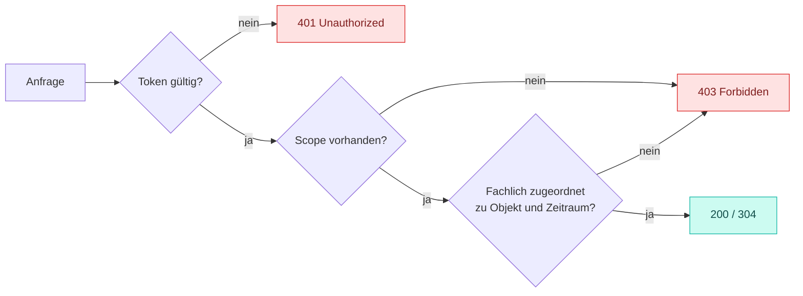

Die konsultierte Fassung enthält **keine** `securitySchemes`. Der Entwurf spezifiziert zwei
Verfahren und weist jeder Operation den erforderlichen Scope zu.

<Warning>
  Das Sicherheitsniveau wird dadurch nicht verändert: Zertifikate der Smart-Metering-PKI
  bleiben die Grundlage. OAuth 2.0 tritt hinzu, um Zugriffe abzubilden, die eine reine
  Marktpartner-Authentisierung nicht abdecken kann.
</Warning>

## Zwei Verfahren

<Columns cols={2}>
  <Card title="OAuth 2.0" icon="key" horizontal>
    Der Regelfall. Die Authentisierung des Clients am Authorization Server erfolgt in der
    Ausbaustufe 1 über das **Signaturzertifikat der Smart-Metering-PKI**.
  </Card>
  <Card title="mTLS" icon="certificate" horizontal>
    Alternativ zulässig für die reine Marktpartner-zu-Marktpartner-Kommunikation, mit
    Zertifikaten der Smart-Metering-PKI in der Rolle „passiver EMT" gemäß den Regelungen zum
    Übertragungsweg für API-Webdienste.
  </Card>
</Columns>

## Warum OAuth hinzutritt

Eine ausschließlich zertifikatsbasierte Marktpartner-Authentisierung kann drei Anforderungen
nicht abbilden:

<Steps>
  <Step title="Zugriff von Letztverbrauchern auf ihre eigenen Daten">
    Ein Letztverbraucher ist kein Marktpartner und hat kein Marktpartner-Zertifikat. Mit dem
    `authorizationCode`-Flow kann er sich anmelden und seine eigenen Daten lesen.
  </Step>
  <Step title="Übertragbare Berechtigungen an Dritte">
    Ein Letztverbraucher oder Anschlussnehmer gibt einem von ihm beauftragten Dienstleister
    Lesezugriff. Das ist eine Freigabe, keine Marktrolle — und genau der Fall, für den der
    `authorizationCode`-Flow vorgesehen ist (Ausbaustufe 2).
  </Step>
  <Step title="Anschlussfähigkeit an übergreifende Datenräume">
    Die Architektur ist so angelegt, dass sie später um OpenID Connect und föderierte
    Identitäten — etwa europäische ID-Wallets — erweitert werden kann, **ohne die
    Ressourcen-APIs zu ändern**.
  </Step>
</Steps>

## Flows

<Tabs>
  <Tab title="clientCredentials">
    Marktpartner zu Marktpartner. Der Regelfall der Marktkommunikation.

    ```yaml
    clientCredentials:
      tokenUrl: https://authz.example-netzbetreiber.de/oauth2/token
      scopes:
        lokationsbuendel:lesen: Lokationsbündel und Lokationen lesen
        lokationsbuendel:schreiben: Lokationsbündel ändern (nur verantwortlicher Netzbetreiber)
        clearing:schreiben: Clearing-Fälle eröffnen und fortschreiben
        netzbetreiberwechsel:schreiben: Übergabepakete anfordern
        benachrichtigung:schreiben: Abonnements verwalten
    ```
  </Tab>
  <Tab title="authorizationCode">
    Freigabe durch einen Menschen. Vorgesehen für die Ausbaustufe 2 — Letztverbraucher bzw.
    Anschlussnehmer gibt einem beauftragten Dienstleister Lesezugriff.

    ```yaml
    authorizationCode:
      authorizationUrl: https://authz.example-netzbetreiber.de/oauth2/authorize
      tokenUrl: https://authz.example-netzbetreiber.de/oauth2/token
      scopes:
        lokationsbuendel:lesen: Lokationsbündel und Lokationen lesen
    ```

    Nur Lesen — eine Freigabe berechtigt nicht zum Ändern fremder Stammdaten.
  </Tab>
</Tabs>

## Scopes je Operation

Die Vorgabe auf Dokumentebene ist `lokationsbuendel:lesen`. Schreibende Operationen
überschreiben sie:

| Scope | Operationen |
|---|---|
| `lokationsbuendel:lesen` | alle 13 `GET` außer `/versions` |
| `lokationsbuendel:schreiben` | `replaceLocationBundle`, `patchLocationBundle`, `replaceTimeSlice`, `deleteTimeSlice` |
| `clearing:schreiben` | `createClearingCase`, `patchClearingCase` |
| `netzbetreiberwechsel:schreiben` | `createNetworkOperatorChangePackage` |
| `benachrichtigung:schreiben` | `createSubscription`, `deleteSubscription` |
| — (`security: []`) | `getImplementationStatus` |

<Note>
  `GET /versions` ist ohne Authentisierung abrufbar. Der Umsetzungsstand enthält keine
  Geschäftsdaten, und die Frage „welche Endpunkte hat dieser Marktpartner implementiert?"
  sollte nicht erst nach einer Anmeldung beantwortbar sein.
</Note>

## Berechtigung ist fachlich, nicht technisch

Ein gültiges Token mit dem richtigen Scope genügt nicht. Die Berechtigung ergibt sich aus der
**fachlichen Zuordnung des Marktpartners zu Objekt und Zeitraum**:



Ein Lieferant, dessen Belieferung zum 31.12.2027 endet, kann am 01.02.2028 keine Zeitscheibe
mehr lesen, die nach seinem Belieferungsende beginnt. Schreibend auf ein Bündel zugreifen darf
ausschließlich der **verantwortliche** Netzbetreiber — nicht jeder Netzbetreiber mit dem
Scope `lokationsbuendel:schreiben`.

## Wegfall der Berechtigung

Der gemeinsame Konsultationsbeitrag vom Oktober 2025 empfiehlt, dass Berechtigte sich selbst
für Benachrichtigungen registrieren, bei Wegfall der Berechtigung jedoch automatisch
de-registriert und darüber benachrichtigt werden.

Der Entwurf folgt dem: Das Abonnement wird serverseitig beendet und ein abschließendes
Ereignis `subscriptionRevoked` zugestellt. Der Abonnent erfährt also, dass und wann seine
Berechtigung endete — statt stillschweigend keine Ereignisse mehr zu erhalten.
