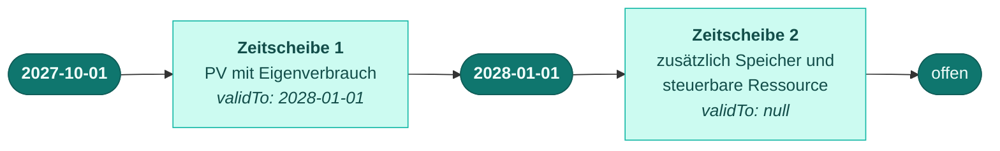

Ein Lokationsbündel ändert seine Zusammensetzung über die Zeit. Jede Zusammensetzung gilt
für einen Zeitraum — eine **Zeitscheibe**.

## Beide Grenzen explizit



So sieht Beispiel 02 aus — eine PV-Anlage mit Eigenverbrauch, zu der zum 01.01.2028 ein
Speicher zugebaut wird. Die erste Scheibe trägt ein Ende, die zweite ist offen.

<CodeGroup>
```json Referenzentwurf
{
  "timeSlices": [
    { "validFrom": "2027-10-01", "validTo": "2028-01-01", "members": ["…"] },
    { "validFrom": "2028-01-01", "validTo": null,          "members": ["…"] }
  ]
}
```

```json Konsultiert
{
  "timeSlices": [
    { "validFrom": "2027-09-30T22:00:00Z", "…": "…" },
    { "validFrom": "2027-12-31T23:00:00Z", "…": "…" }
  ],
  "_kommentar": "Ende jeder Scheibe nur implizit aus dem Beginn der Folgescheibe;
                 Ende der letzten Scheibe über ein separates Feld auf Bündelebene."
}
```
</CodeGroup>

`validTo` ist der erste Tag, an dem die Zusammensetzung **nicht mehr** gilt — exklusiv. `null`
bedeutet: offen, kein Ende bekannt. Beide Felder sind Pflicht (`null` ist ein zulässiger Wert
für `validTo`, das Weglassen nicht).

## Warum das Ende explizit gehört

In der konsultierten Fassung existiert kein Ende-Feld. Das Ende ergibt sich implizit aus dem
Beginn der Folgescheibe, das Ende der letzten Scheibe über ein separates Feld auf Bündelebene.

Damit lassen sich zwei Fehlerarten im Schema **nicht erkennen**:

<Columns cols={2}>
  <Card title="Lücke" icon="scissors">
    Scheibe 1 endet am 01.01.2028, Scheibe 2 beginnt am 01.03.2028. Zwei Monate ohne gültige
    Zusammensetzung. Implizit ausgedrückt ist das von einem korrekten Verlauf nicht
    unterscheidbar.
  </Card>
  <Card title="Überlappung" icon="layer-group">
    Zwei Scheiben, die sich überschneiden. Welche gilt am Stichtag? Ohne explizites Ende hat
    die Frage keine im Dokument beantwortbare Antwort.
  </Card>
</Columns>

Mit explizitem `validTo` sind beide prüfbar: Für jede Scheibe `n` muss
`validTo[n] == validFrom[n+1]` gelten, und nur die letzte Scheibe darf `validTo: null`
tragen.

<Note>
  Der Entwurf drückt die Bedingung „lückenlos und nicht überlappend" nicht selbst als
  Schema-Regel aus — JSON Schema kann Beziehungen zwischen Array-Elementen nicht
  formulieren. Er stellt aber die Felder bereit, die die Prüfung überhaupt erst möglich
  machen. Das ist der Unterschied zwischen „mit zwei Zeilen Code prüfbar" und „im Dokument
  nicht entscheidbar".
</Note>

## Kalendertag statt UTC-Zeitstempel

Zeitscheibengrenzen sind `DayBoundary` — ein Kalendertag im Format `YYYY-MM-DD`. Der
zugehörige Zeitpunkt ist stets der Tagesbeginn 00:00 Uhr gesetzlicher deutscher Zeit.

Die konsultierte Fassung überträgt denselben Sachverhalt als UTC-Zeitstempel mit
Regex-Muster:

| Gemeint | Konsultiert | Hier |
|---|---|---|
| 2. August 2023, Tagesbeginn | `2023-08-01T22:00:00Z` | `2023-08-02` |
| 1. Januar 2028, Tagesbeginn | `2027-12-31T23:00:00Z` | `2028-01-01` |

Beide Schreibweisen bezeichnen denselben Moment. Die linke ist fehleranfällig, weil der
Zeitzonenversatz zwischen Sommer- und Winterzeit wechselt (zwei Stunden im August, eine
Stunde im Januar) und ein Leser den Kalendertag zurückrechnen muss — einschließlich des
Datumssprungs über den Jahreswechsel.

<Warning>
  Die **Semantik ist unverändert**: Der Tagesbeginn 00:00 Uhr gesetzlicher deutscher Zeit
  bleibt maßgeblich. Geändert ist nur die Schreibweise. Zeitstempel von Vorgängen
  (`changedAt`, `openedAt`, `occurredAt`, `resolvedAt`) bleiben vollständige
  `date-time`-Angaben in UTC — dort ist der Moment gemeint, nicht der Kalendertag.
</Warning>

## Zeitscheiben gezielt abrufen

<Tabs>
  <Tab title="Zum Stichtag">
    Gibt nur die Zeitscheibe zurück, die am angefragten Tag gilt.

    ```http
    GET /nb/2026-2/location-bundles/F1234848431?valid-at=2027-11-01
    ```

    Das ist der Regelfall. Ein Lieferant, der zum 01.11.2027 abrechnet, braucht nicht die
    Historie und nicht die Zukunft.
  </Tab>
  <Tab title="Nur die Grenzen">
    Gibt die Zeitscheiben als eigene Listenressource zurück.

    ```http
    GET /nb/2026-2/location-bundles/F1234848431/time-slices?valid-from=2027-10-01
    ```

    Beantwortet „ändert sich die Zusammensetzung, und wann?", ohne die Zusammensetzung zu
    übertragen.
  </Tab>
  <Tab title="Eine einzelne Scheibe">
    Die Zeitscheibe ist über ihren Beginn adressierbar.

    ```http
    GET /nb/2026-2/location-bundles/F1234848431/time-slices/2027-10-01
    ```

    Dieselbe URL nimmt `PUT` zum Setzen und `DELETE` zum Entfernen — beide mit `If-Match`.
  </Tab>
</Tabs>

## Eine Scheibe ändern

Die Korrektur eines einzelnen Feldes erfordert in der konsultierten Fassung die
Vollübermittlung sämtlicher Zeitscheiben. Hier genügt die betroffene Scheibe:

```http
PUT /nb/2026-2/location-bundles/F1234848431/time-slices/2027-10-01
If-Match: "a3f1c9e2"
Content-Type: application/vnd.edi-energy+json

{
  "validFrom": "2027-10-01",
  "validTo": "2028-01-01",
  "members": ["…"],
  "relations": ["…"]
}
```

`PUT` ist nach HTTP-Semantik idempotent: Ein wiederholter identischer Aufruf hat dieselbe
Wirkung wie ein einzelner. Siehe
[Nebenläufigkeit](/architektur/nebenlaeufigkeit#idempotenz-nach-http-semantik).
