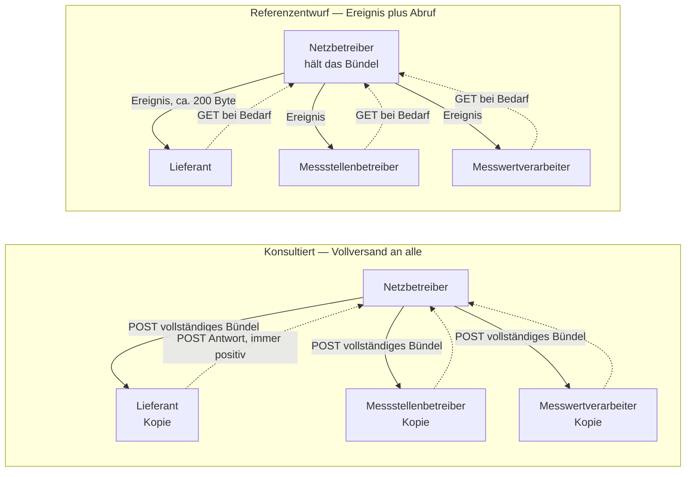

## Der Vortrag der Stellungnahme

Die Stellungnahme trägt vor, dass die konsultierten „API-Webdienste" keine
ressourcenorientierten Web-APIs sind, sondern **asynchroner Dokumentenversand über HTTP** —
und dass damit das strukturelle Grundproblem der Marktkommunikation, die replizierte
Stammdatenhaltung, unverändert in die neue Technik übernommen wird.

Dieser Entwurf belegt, dass es anders geht.

## Versand gegen Abruf

<Columns cols={2}>
  <Card title="Konsultierte Fassung — Versand" icon="paper-plane" horizontal>
    Der Netzbetreiber versendet das Lokationsbündel an alle Berechtigten. Jeder Berechtigte
    hält danach eine eigene Kopie, die ab diesem Moment altern kann. Es gibt **n Kopien**
    desselben Sachverhalts.
  </Card>
  <Card title="Referenzentwurf — Abruf" icon="download" horizontal>
    Der Netzbetreiber hält das Lokationsbündel und stellt es bereit. Berechtigte rufen es
    ab, wenn sie es brauchen. Es gibt **eine Wahrheit** und keine Replikate, die
    auseinanderlaufen können.
  </Card>
</Columns>

Wer nicht repliziert, kann keinen Schiefstand haben. Das ist der Kern.

## Was der Entwurf belegen soll

<Steps>
  <Step title="Der Fachinhalt ist ressourcenorientiert abbildbar">
    Dieselben Identifikatoren, dieselbe Zeitpunkt-Semantik, dieselben Marktrollen, dieselben
    Antwortcodes der Entscheidungsbaumdiagramme — in 14 Pfaden mit 22 Operationen statt vier
    `POST`-Endpunkten. Siehe [Ressourcenmodell](/architektur/ressourcenmodell).
  </Step>
  <Step title="Zwei alltägliche Vorgänge sind in der konsultierten Fassung architektonisch ausgeschlossen">
    „Ist mein Stand noch aktuell?" und „Gib mir das Bündel, das mir zusteht" lassen sich
    dort nicht durchführen und weichen in der Praxis auf Klärfall oder Telefon aus. Siehe
    [Stand prüfen](/ablaeufe/stand-pruefen) und
    [Neuer Berechtigter](/ablaeufe/neuer-berechtigter).
  </Step>
  <Step title="Fachliche Bedingungen gehören in das Schema und sind dort prüfbar">
    Zwei Negativbeispiele, die jeder Standardvalidator zur Entwurfszeit ablehnt, statt sie
    im Produktivbetrieb als Klärfall auffallen zu lassen. Siehe
    [Typisierung](/architektur/typisierung) und [Beispiele](/referenz/beispiele).
  </Step>
  <Step title="Der Aufwand ist überschaubar">
    Dass dieser Entwurf mit begrenztem Aufwand entstehen konnte, weil das Datenmodell bereits
    erarbeitet ist, stützt die Einschätzung, dass ein Pilot zum Termin möglich wäre. Siehe
    [Antizipierte Einwände](/gegenueberstellung/einwaende).
  </Step>
</Steps>

## Was der Entwurf nicht ist

<AccordionGroup>
  <Accordion title="Kein vollständiger Ersatzvorschlag" icon="circle-minus">
    Er lässt Themen bewusst offen, die für den Nachweis nicht erforderlich sind:
    Massendatenerstbefüllung, Archivierung, Mandantentrennung.
  </Accordion>
  <Accordion title="Keine Änderung der Fachlichkeit" icon="lock">
    Identifikatoren, Zeitpunkt-Semantik, Marktrollen und die Antwortcodes der
    Entscheidungsbaumdiagramme sind unverändert übernommen. Die vollständige Liste steht
    unter [Was unverändert bleibt](/referenz/unveraendert).
  </Accordion>
  <Accordion title="Kein Vorschlag für den Termin 01.10.2027" icon="calendar">
    Die Stellungnahme schlägt in Abschnitt 3.9 vor, mindestens einen Dienst **zusätzlich**
    als ressourcenorientierten Lesedienst auf einem Entwicklungsserver bereitzustellen und
    in der Konsultationsrunde Februar 2027 über die Übernahme zu entscheiden. Der Termin
    bleibt unberührt.
  </Accordion>
  <Accordion title="Kein offizielles Dokument" icon="triangle-exclamation">
    Konsultationsbeitrag eines Marktteilnehmers — nicht der Bundesnetzagentur, des BDEW oder
    der Projektgruppe EDI@Energy.
  </Accordion>
</AccordionGroup>

## Gegenstand des Vergleichs

| | |
|:---|:---|
| Konsultierte Fassung | `api/masterData/locationBundleV1.yaml`, Branch `2026-07-31-consultation`, Repository `EDI-Energy/api-electricity` |
| Referenzentwurf | `openapi/netzbetreiber-api.yaml`, Tag `konsultation-2026-08` |
| Fachlicher Umfang | identisch — Übermittlung, Antwort, Clearing und Netzbetreiberwechsel von Lokationsbündeln |
| Stand der Auswertung | 21.08.2026 |
