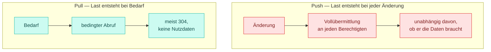
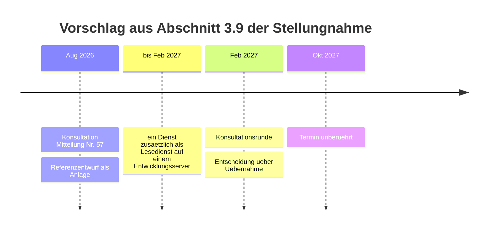

Wir halten es für redlich, die Einwände gegen den Vorschlag selbst zu benennen und zu
beantworten, statt sie abzuwarten.

## „Synchrone Abfragen erzeugen Lastspitzen, die Netzbetreiber nicht bewältigen können."

<Note>
  Das ist der ernsthafteste Einwand.
</Note>

**Erstens** sind Lokationsbündel Stammdaten, die sich selten ändern. `ETag`, `Cache-Control`
und bedingte Anfragen führen dazu, dass der überwiegende Teil der Abrufe mit `304` **ohne
Nutzdaten** beantwortet wird. HTTP ist bei korrekter Nutzung von Caching auf genau dieses
Lastprofil ausgelegt.

**Zweitens** ist die Lastspitze im Push-Modell nicht kleiner, sondern nur anders verteilt:



**Drittens** beantragt die Stellungnahme ohnehin Mindestanforderungen an Verfügbarkeit und
Kapazität sowie eine normierte Retry-Strategie. Diese Anforderungen sind im Pull-Modell nicht
höher — sie werden dort nur sichtbar, weil das Verhalten des Gegenübers unmittelbar spürbar ist.

## „Netzbetreiber müssten dann erstmals eine Serverinfrastruktur betreiben."

Das müssen sie ohnehin. Die konsultierten Dienste sind **bidirektional**: Jeder Marktpartner
muss alle vier Endpunkte serverseitig implementieren, um Übermittlungen, Antworten und
Clearings entgegenzunehmen. Die Stellungnahme weist darauf hin, dass für Netzbetreiber ohne
bisherige API-Anbindung damit ohnehin ein neues Betriebsmodell entsteht.

Der Unterschied ist gering: Statt vier `POST`-Endpunkten sind Leseoperationen bereitzustellen.

<Columns cols={4}>
  <Card title="Zustandslos" icon="feather">
    Ein `GET` verändert nichts. Keine Transaktionsklammer, kein Rollback.
  </Card>
  <Card title="Cachefähig" icon="database">
    Die Antwort darf wiederverwendet werden, solange der `ETag` gilt.
  </Card>
  <Card title="Horizontal skalierbar" icon="server">
    Mehr Last wird mit mehr gleichartigen Instanzen bedient.
  </Card>
  <Card title="Vorlagerbar" icon="shield">
    Ein vorgelagerter Dienst kann Leselast übernehmen, ohne Fachlogik zu kennen.
  </Card>
</Columns>

Leseoperationen sind der **besser beherrschte Fall**.

## „Der Versand ist revisionssicher, der Abruf nicht."

Der Einwand trifft nicht zu. Auch im Referenzentwurf protokolliert der Verantwortliche jede
Änderung mit Zeitpunkt und `ETag`, und jeder Abruf ist serverseitig protokollierbar.

Der Unterschied besteht darin, **wo** der Nachweis geführt wird:

| | Versand | Abruf |
|---|---|---|
| Nachweis liegt | bei jedem Empfänger einzeln | beim Verantwortlichen |
| Anzahl der Fassungen | n Kopien | eine Wahrheit |
| Bei Widerspruch | n Protokolle sind zu vergleichen | ein Protokoll entscheidet |

Das ist die verlässlichere Konstruktion, weil es genau **eine** Wahrheit gibt statt n Kopien.

Für den Nachweis, welchen Stand ein Berechtigter zu einem bestimmten Zeitpunkt gesehen hat,
sieht der Entwurf `observedETag` im Clearing-Fall vor — siehe
[Nebenläufigkeit](/architektur/nebenlaeufigkeit#der-etag-als-beweismittel).

## „Das ist ein zu großer Bruch für den Termin 01.10.2027."

Der Referenzentwurf ist **nicht** als Ersatz für die konsultierte Fassung zum Termin gedacht.

Die Stellungnahme schlägt in Abschnitt 3.9 vor, mindestens einen Dienst **zusätzlich** als
ressourcenorientierten Lesedienst auf einem Entwicklungsserver bereitzustellen und in der
Konsultationsrunde Februar 2027 über die Übernahme zu entscheiden. Der Termin bleibt unberührt.



Dass dieser Entwurf mit begrenztem Aufwand entstehen konnte, weil das Datenmodell bereits
erarbeitet ist, stützt die Einschätzung, dass der Pilotaufwand überschaubar wäre.

## „Ohne zentrale Instanz ist die Endpunktauflösung ungelöst."

Sie ist im Referenzentwurf **identisch** zur konsultierten Fassung gelöst: über den
dezentralen Verzeichnisdienst.

Der Unterschied ist nur, dass der `servers`-Block dies als Variablenmuster abbildet, statt leer
zu bleiben:

```yaml
servers:
  - url: https://{host}/nb/{basePath}
    variables:
      host:
        default: api.example-netzbetreiber.de
      basePath:
        default: "2026-2"
```

Die API-Kennung ist `nb`. Siehe
[Betrieb und Versionierung](/architektur/betrieb#semester-release-im-basispfad).

## Was offen bleibt

<Warning>
  Der Entwurf lässt Themen bewusst offen, die für den Nachweis nicht erforderlich sind. Das ist
  keine Antwort auf einen Einwand, sondern eine Einschränkung des Geltungsbereichs:

  - **Massendatenerstbefüllung** — der Mechanismus aus
    [Netzbetreiberwechsel](/ablaeufe/netzbetreiberwechsel) (`202`, `Location`, `Retry-After`)
    wäre anwendbar, ist aber nicht ausgearbeitet.
  - **Archivierung** — wie lange historische Zeitscheiben abrufbar bleiben müssen.
  - **Mandantentrennung** — Dienstleister, die für mehrere Marktpartner handeln.
  - **Katalog der Fehlerarten** — der Entwurf legt die Struktur nach RFC 9457 fest, nicht die
    Liste der `type`-Werte.
</Warning>
