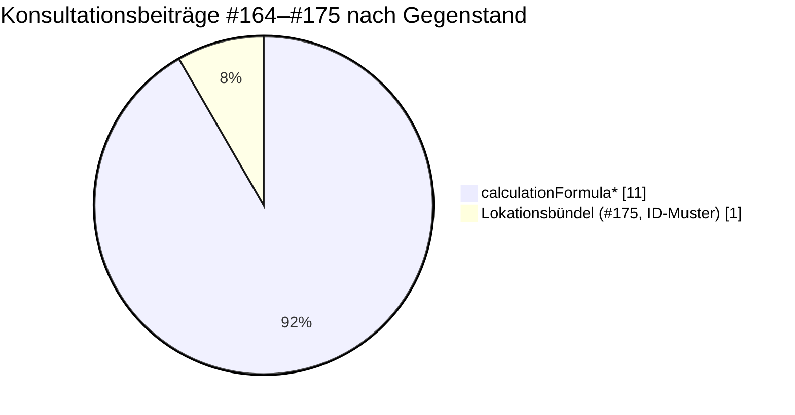

## Einreichung

| | |
|:---|:---|
| Konsultation | Mitteilung Nr. 57 der Bundesnetzagentur — Datenformate zur Abwicklung der Marktkommunikation |
| Frist | 31.08.2026 |
| Eingereichter Stand | Tag [`konsultation-2026-08`](https://github.com/engrate/mako-api-referenzentwurf/tree/konsultation-2026-08) |
| Anlage | `Gegenueberstellung.md` / `.pdf` und dieses Repository |
| Lizenz | [CC0 1.0 Universal](https://github.com/engrate/mako-api-referenzentwurf/blob/main/LICENSE) |

<Warning>
  Verweise in der Stellungnahme und in den Konsultationsbeiträgen zeigen auf den Tag
  `konsultation-2026-08`, **nicht auf `main`**. Der eingereichte Stand ist damit unveränderlich
  festgehalten, auch wenn das Repository weiterentwickelt wird — diese Dokumentationsseite
  gehört etwa nicht zum eingereichten Stand.
</Warning>

## Lage der Konsultationsbeiträge

Stand 21.08.2026 liegen im Repository `EDI-Energy/api-electricity` **zwölf**
Konsultationsbeiträge vor (#164–#175), davon elf von einem einzigen Marktteilnehmer.

**Elf der zwölf betreffen `calculationFormula*`.** Zum Lokationsbündel gibt es genau einen
Beitrag — #175 zum Muster der Lokationsbündel-ID.

<Note>
  Das ist der Anlass für diesen Entwurf: Die mit Abstand folgenreichste Datei der Konsultation
  ist fachlich kaum geprüft worden. Der Referenzentwurf liefert diese Prüfung — nicht als
  Mängelliste, sondern als durchgerechnete Alternative.
</Note>

## Bezug zu Beitrag #172

Beitrag **#172** prüft `calculationFormulaV1.yaml` ausführlich gegen RFC-Vorgaben und schränkt
seinen Geltungsbereich ausdrücklich ein:

> „Es wurde in dieser Prüfung keine Aussage darüber getroffen und auch nicht untersucht, ob die
> übrigen API-Dateien im Repository dieselben, andere oder keine der unten beschriebenen
> Abweichungen aufweisen. […] auch wenn eine strukturelle Ähnlichkeit (gleiche Kopiervorlage,
> gleicher Autor, gleicher Erstellungszeitraum) eine Wahrscheinlichkeit für ähnliche
> Abweichungen nahelegt."

Dieser Referenzentwurf liefert genau diesen Nachweis für `locationBundleV1.yaml`. Die Befunde
zu fehlenden Response-Bodies, fehlenden `securitySchemes`, fehlender `operationId` und
`$ref`-Geschwisterfeldern treten dort **identisch** auf — und darüber hinaus Mängel, die in
`calculationFormula` keine Entsprechung haben: Zeitscheiben ohne Ende, Clearing ohne
Endzustand, Antwort ohne Ablehnungsmöglichkeit.

<Card title="Befunde im Einzelnen" icon="magnifying-glass" href="/gegenueberstellung/befunde">
  Die vollständige Auswertung, mit Schreibweisen und Fundstellen.
</Card>

## Bezug zu Beitrag #175 — die Lokationsbündel-ID

Beitrag #175 (eingereicht am 20.08.2026) macht geltend, dass nach der Bildungsvorschrift an der
ersten Stelle der Lokationsbündel-ID `G` statt `F` stehen muss.

<Columns cols={2}>
  <Card title="Wir teilen diese Auffassung" icon="thumbs-up" horizontal>
    Das Muster `^F[A-Z\d]{9}\d$` ist nach der Bildungsvorschrift unzutreffend.
  </Card>
  <Card title="Der Entwurf verwendet weiterhin F" icon="equals" horizontal>
    Um gegen den konsultierten Stand **vergleichbar** zu bleiben. Die Stelle ist im Schema
    entsprechend kommentiert. Wird der Beitrag angenommen, sind Muster und Beispiele hier und
    in den beigefügten Payloads auf `G` zu ändern.
  </Card>
</Columns>

## Herkunft der Empfehlungen

Der Entwurf folgt den Empfehlungen des gemeinsamen Konsultationsbeitrags **„Gestaltung von
Web-APIs für die Marktkommunikation"** vom Oktober 2025 zur Konzeptkonsultation der Mitteilung
Nr. 53, eingebracht von decarbon1ze, Mako365, hochfrequenz, metiundo, Kraken und sonnen.

Konkret aufgegriffen sind daraus unter anderem:

| Empfehlung | Umsetzung im Entwurf |
|---|---|
| Ressourcenorientierung, HTTP-Verben nach Semantik | 14 Pfade, 22 Operationen, fünf Verben |
| Lesezugriff auf Stammdaten | 13 `GET`-Operationen |
| Verlinkung statt Fachschlüssel im Body | `href` auf jeder Ressource, `links` je Dokument |
| Fehlerformat nach RFC 9457 | `Problem` mit JSON-Pointer auf die Fundstelle |
| Selbstregistrierung für Benachrichtigungen, automatische De-Registrierung bei Wegfall der Berechtigung | `POST /subscriptions`, Ereignis `subscriptionRevoked` |
| Nebenläufigkeit und Zwischenspeicherbarkeit | `ETag`, `If-Match`, `If-None-Match`, `Cache-Control` |

## Vorschlag zum weiteren Vorgehen

Die Stellungnahme schlägt in Abschnitt 3.9 vor, **mindestens einen Dienst zusätzlich** als
ressourcenorientierten Lesedienst auf einem Entwicklungsserver bereitzustellen und in der
Konsultationsrunde Februar 2027 über die Übernahme zu entscheiden.

Der Termin 01.10.2027 bleibt davon unberührt. Siehe
[Antizipierte Einwände](/gegenueberstellung/einwaende).

## Lizenz und Kontakt

<Columns cols={2}>
  <Card title="CC0 1.0 Universal" icon="scale-balanced" href="https://github.com/engrate/mako-api-referenzentwurf/blob/main/LICENSE" horizontal>
    Frei verwendbar, einschließlich der Übernahme in offizielle Dokumente der
    Bundesnetzagentur, des BDEW oder der Projektgruppe EDI@Energy. Eine Namensnennung ist nicht
    erforderlich.
  </Card>
  <Card title="Engrate AB" icon="envelope" horizontal>
    Drottninggatan 32 · 111 51 Stockholm · Schweden

    Rainer Notter · [rainer@engrate.io](mailto:rainer@engrate.io)
  </Card>
</Columns>
